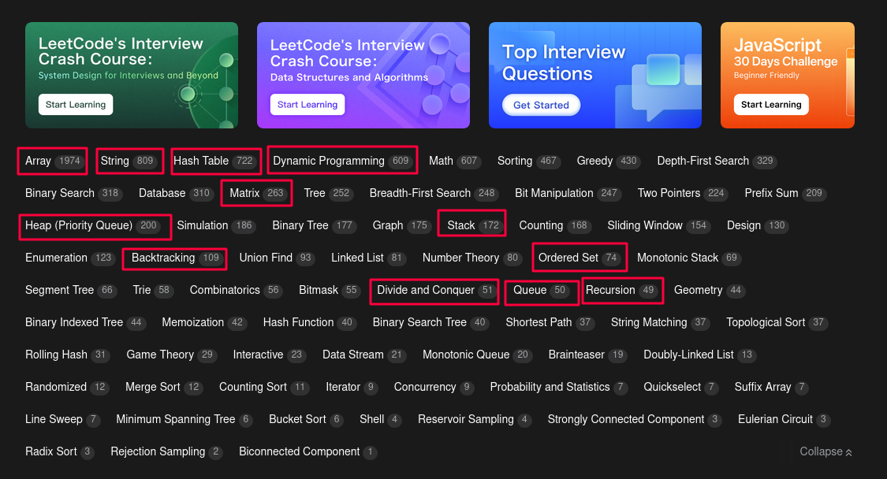

# LeetCode Solutions

From now try to solve this category problems from leetcode. Most of them are covered in the live classes. First try to solve easy problems and then mid then hard. Try to solve at least one. Also practice from our sheet

